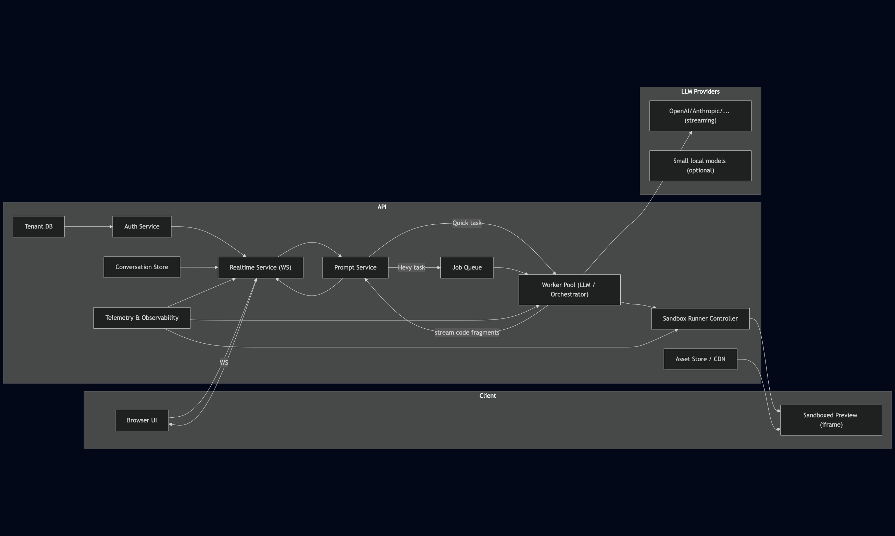
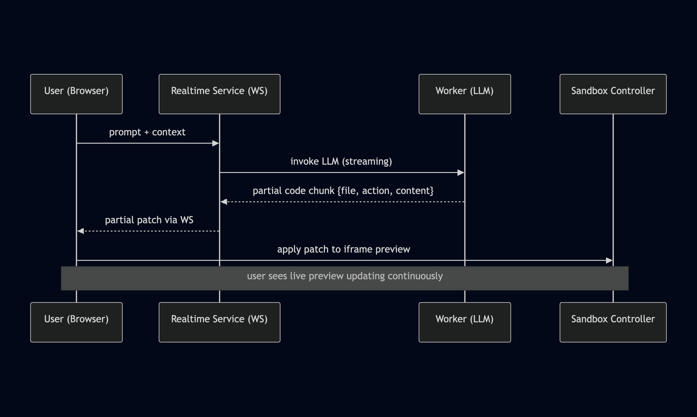

# Quick Notes
I'm not very proficient in LLM integrations and haven't worked on something like this before, but I did my best after some research :)
It took me several hours to prepare this complex analysis.

# Problem Statement
Design a system similar to v0.dev that generates interactive React components from natural language prompts and renders them in real-time.

## Key Requirements
- Real-time code generation
- Interactive iteration capabilities
- Concurrent user isolation

## Critical Design Challenges
- **Cost Optimization**: How to minimize LLM and infrastructure expenses?
- **Performance**: How to serve responses as quickly as possible?
- **Streaming**: How to deliver responses progressively?
- **Function Calling**: How to enable LLM interaction with development tools?
- **Security**: How to ensure safe code execution in sandboxed environments?
- **State Management**: How to maintain context across user sessions and iterations?
- **Scalability**: How to handle multiple concurrent users efficiently?
- **Resilience**: How to cope with system outages and failures?

# System Architecture

- Client uses WebSockets for low-latency streams
- Realtime Service
  - coordinates user socket sessions
  - streams incremental diffs to the client
  - reads and writes conversation context to the Store
  - sends context alongside prompt to the Prompt Service
- Conversation Store
  - keeps all historic messages and code versions
  - In-memory session cache for hot state (current sessions)
- Prompt Service
  - handles prompt templates
  - caching
  - cost controls
- Worker Pool
  - handles heavy LLM interactions (through queue)
  - structured function calls
  - parsing
  - validation
- Sandbox Runner Controller manages isolated preview environments
- Telemetry captures token usage, latencies, and sandbox resource health

# Technical Implementation
## Infrastructure & Deployment
It is better to choose cloud services over hosted or on-premise solutions for fast-growing businesses. You don't have to hire system administrators and you are always ready for popularity peaks. Cloud services can handle load balancing, auto-scaling, and traffic redirection as needed.

**Tradeoffs**: Costs can be higher over time.

## Technology Stack
### Programming Language
The choice of programming language can have a significant impact on the system's performance, although LLM response time dominates user-perceived latency.
It is better to choose one of the popular languages so we can easily find someone to join our team. Scaling with additional server resources is cheaper than hiring expensive developers for a high-performance but (sometimes) niche language.

**Tradeoffs**: Cheaper maintenance over second-to-none performance.

### Communication
We use WebSockets to allow low-latency communication between the browser and the server.

**Tradeoffs**: The connection has to be maintained and the client must reconnect if needed.

### LLM
Gemini 2.5 and Claude 4 Sonnet are considered the best LLMs for understanding and implementing code.
We can use cheaper models for drafts and minor edits and use larger models only for final generation or when requested by the user.

**Tradeoffs**: Using cheaper models can sometimes lead to a worse experience for the user if they are not aware of this behavior.

### Prompt Template
One of the value propositions of such services is their prompt templates used for in-context learning. Such a template contains many carefully selected instructions that can help the user achieve expected results and make the user-generated code compatible with our infrastructure and security checks. We need to specify a list of requirements such as allowed dependencies, used frameworks, and forbidden outputs (that can be against the law or terms of service), but we can also add technical tips to guide the model.

**Tradeoffs**: Larger context and more tokens used, which leads to higher costs.

## Streaming and Incremental Preview

1. Structured streaming + function calls: Request LLM to stream JSON chunks or code-block diffs (prefer function calling or JSON lines if supported by model) to make parsing reliable.
2. Token parser on Worker: Worker parses the stream into code fragments (files/modules/components) and patches.
3. Diff/patch strategy:
  * Use logical file granularity: send file path, action: replace/patch/append, content chunks.
  * On client, apply patches to code editor and trigger sandbox reload/patch
4. Optimistic preview: apply patches immediately in iframe sandbox, keep a canonical server-side version for rollback.

**Tradeoffs**: Immediate feedback, but more complex parsing + potential for intermediate invalid JS leading to flicker

## Multi-tenant Isolation
 - Authentication via Auth Service (OAuth/JWT)
 - Server enforces tenant scoping for every operation
 - Sandboxes labeled with tenant ID and served only to their owners

## Security
We need to implement many levels of defense against user-generated malicious code:
- Securing against prompt injection attacks
  - Prompt template should contain instructions about ignoring parts of the prompt that are not related to code generation
  - We need to make sure the output does not contain a full or partial prompt template
  - Output should be scanned to determine if it is generated code or just an answer to the injected prompt
  - We can create a list of banned phrases commonly used to exploit AI agents
  - As an additional layer, we can use a small and fast AI model to assess if the prompt is safe. Here we can use function calling with the result of the assessment.
- Sandboxing Client-side preview
  - **Cross-origin iframe** per session served from isolated domain to prevent malicious actions on origin
  - **No network**: iframe origin blocks loading resources via CSP, proxy allowed only to vetted asset CDN if needed.
  - **JS API surface minimization**: before sending code to iframe, run static checks to ban `fetch`, `WebSocket`, `eval`, `document.cookie`, `window.localStorage`, and other functionalities that can be used for harmful actions
  - **Module scoping**: wrap user component into a single root React component and a tiny runtime that exposes only safe hooks.
- Sandboxing Server-side
    - If server-side execution is required, run inside temporary container per session:
      - Container (e.g., Docker) with resource limits and Linux Kernel hardening modules like SELinux
      - Networking disabled by default (or only through controlled exit proxy).
      - Time and memory limits, auto-kill long-running processes.
      - Use non-persistent filesystem, capture logs and outputs.
    - Static analysis + runtime monitors:
      - Run static analyzers to catch suspicious patterns and dependencies.
      - Instrument runtime with resource meters - kill on abuse.
- Securing supply chain
  - Use allowlist of dependencies in code
- Securing the system in general
  - Use rate limits per user
  - Job Queue - LLM calls and heavy bundles go through queue, light ones direct-stream

**Important note:**
It is impossible to secure the system fully. Threat actors will always find new vulnerabilities; therefore, constant monitoring is necessary.

## Performance Optimization
- Server-side previews should be killed when idle to save resources. If the user comes back, we can start the container again (it will take a few seconds, so we need to show a loading screen to the user, also the state will be lost)
- We can use CDNs for static content and Cloud Data Centers for services to serve from a location close to our users
- Use smaller/cheaper models for quick changes
- Cache LLM responses for identical prompts
- Create (or use already existing like Headless UI) headless component frameworks to save some tokens on generating commonly used components
- Patch updates - send only diffs to LLM (and to the client) when modifying existing code. This can not only increase performance but also prevent LLM from making unexpected changes
- Unload old iframes and free worker resources on session expiration
- Use function calling to limit tokens and get structured responses
- Workers should scale automatically based on LLM latency and queue depth

# Operational Considerations
## Monitoring and Observability
- Time-to-first-preview metric
- Streaming latency
- Preview success rate
- Sandbox crash rate
- Tokens per session
- Model selection distribution
- Blocked code counts
- Queue depth
- Worker latency
- LLM provider failures

## Error Handling and Recovery
- If one (or more) of the LLM providers is unavailable, we can switch to a different model with similar performance from a different provider until the outage is resolved.
- Systems in our infrastructure should be running in multiple instances in case of problems with some of them
- Our systems should be hosted on servers in different locations (cities, countries) in case of disasters
- We have to have backups of every database
- Make periodic health checks to detect memory leaks

## Cost Management
- If the project becomes popular and large in scale, it can start to generate significant costs allocated to cloud services. That will be a good moment to consider hosted servers, which are cheaper but require management.
- Consider using a local small model for drafts or quick iterations like code summarization or minor edits. It can save a lot of external tokens.

# Future Considerations
## Component Versioning and Rollback
Every change is saved in the Conversation Store as a new version and can be reverted on demand.

## Handling Different UI Frameworks
We can prepare a Prompt Template and a set of validation rules for every major framework to allow different dependencies and best practices instructions for the LLM.

## Collaborative Editing Features
Collaboration logic can sit in the Realtime Service; LLM edits are applied as operations that can be accepted/merged by users. In case of conflicts, LLM's patches are presented as suggestions and users choose what to accept.
