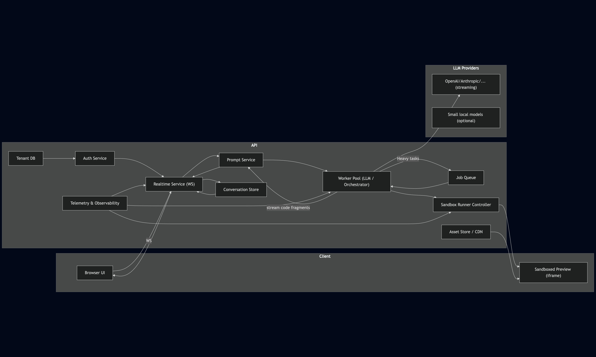

# Problem Statement
Design a system similar to v0.dev that generates interactive React components from natural language prompts and renders them in real-time.

## Key Requirements
- Real-time code generation
- Interactive iteration capabilities
- Concurrent user isolation

## Critical Design Challenges
- **Cost Optimization**: How to minimize LLM and infrastructure expenses?
- **Performance**: How to serve responses as quickly as possible?
- **Streaming**: How to deliver responses progressively?
- **Function Calling**: How to enable LLM interaction with development tools?
- **Security**: How to ensure safe code execution in sandboxed environments?
- **State Management**: How to maintain context across user sessions and iterations?
- **Scalability**: How to handle multiple concurrent users efficiently?
- **Resilience**: How to cope with system outages and failures?

# System Architecture

- Client uses a WebSocket for low-latency streams
- Realtime Service
  - coordinates user socket sessions
  - streams incremental diffs to the client
  - sends conversation history if needed (eg. on browser refresh)
- Prompt Service

# Technical Implementation
## Infrastructure & Deployment
It is better to choose cloud services over hosted or on-premise ones for fast growing businesses. You don't have to hire system administrators and you are always ready for popularity peaks. It can handle load balancing, auto scaling and redirecting traffic if needed.

**Tradeoffs**: Costs can be higher over time.

## Technology Stack
### Programming language
The choice of programming language can have significant impact on the system's performance although LLM's response time dominates user-perceived latency.
It is better to choose one of the popular languages, so we can easily find someone to join our team. Scaling with additional server resources is cheaper than hiring expensive developers in a high performant but (sometimes) niche language.

**Tradeoffs**: Cheaper maintenance over second-to-none performance.

### Communication
We use Web Sockets to allow low-latency communication between Browser and the server.

**Tradeoffs**: The connection has to be held and client must reconnect if needed.

### LLM
Gemini 2.5 and Claude 4 Sonnet are considered the best LLMs for understanding and implementing code. We can use cheaper models for drafts and minor edits and use larger models only for final generation or when requested by the user.

**Tradeoffs**: The usage of cheaper models can sometimes lead to a worse experience for the user if they are not conscious of this behavior.

### Internal prompt
One of the value propositions of such services is their internal prompt used for in-context learning. Such a prompt contains a lot of carefully selected instructions which can help the user achieve expected results and make the user-generated code compatible with our infrastructure and security checks. We need to specify in it a list of requirements such as allowed dependencies, used frameworks, forbidden outputs (that can be against the law or terms of service), but we can also add a bunch of technical tips to guide the model.

**Tradeoffs**: Larger context and more tokens used which leads to higher costs.

## Streaming and incremental preview

## State, multi-tenant isolation, concurrency

## Security
We need to implement many levels of defence against user-generated malicious code:
- Securing against prompt injection attacks
  - Internal prompt should contain instructions about ignoring parts of the prompt that are not related to the code generation
  - We need to make sure the output does not contain a full or partial internal prompt
  - Output should be scanned to determine if it is a generated code or just a text answer to the injected prompt
  - We can create a list of banned phrases commonly used to exploit AI agents
  - As an additional layer we can use a small and fast AI model to assess the prompt if its safe
- Sandboxing Client-side preview
  - **Cross-origin iframe** per session served from isolated domain to prevent malicious actions on origin
  - **No network**: iframe origin blocks outbound fetches via CSP, proxy allowed only to vetted asset CDN if needed.
  - **JS API surface minimization**: before sending code to iframe, run static checks to ban `fetch`, `WebSocket`, `eval`, `document.cookie`, `window.localStorage` and other functionalities that can be used for harmful actions
  - **Module scoping**: wrap user component into a single root React component and a tiny runtime that exposes only safe hooks.
- Sandboxing Server-side
    - If server-side execution required, run inside temporary container per session:
      - Container (eg. Docker) with resource limits and Linux Kernel hardening modules like SELinux
      - Networking disabled by default (or only through controlled exit proxy).
      - Time and memory limits, auto-kill long-running processes.
      - Use non-persistent filesystem, capture logs and outputs.
    - Static analysis + runtime monitors:
      - Run static analyzers to catch suspicious patterns and dependencies.
      - Instrument runtime with resource meters - kill on abuse.
- Securing supply-chain
  - Use allowlist of dependencies in code

**Important note:**
It is impossible to secure the system fully. Threat actors will always find new vulnerabilities, therefore constant monitoring is necessary.

## Performance Optimization
- Server-side previews should be killed when idle to save resources. If the user comes back we can start the container again (it will take few seconds so we need to show a loading screen to the user)
- We can use CDNs for static content and Cloud Data Centers for services to serve  from a location close to our users

# Operational Considerations
## Monitoring and Observability
## Error Handling and Recovery
- If one (or more) of LLM Providers is unavailable we can switch to a different model with a similar performance from different provider until the outage is solved.
- Systems in our infrastructure should be running in multiple instances in case of problems with some of them
- Our systems should be hosted on servers in different locations (cities, countries) in case of disasters
- We have to have backups of every database
## Cost Management
- If the project becomes popular and large in scale, it can start to generate significant costs allocated to cloud services. That will be a good moment to consider hosted servers which are cheaper but require management.
- Consider using a local small model for drafts or quick iterations like code summarization or minor edits. It can save a lot of external tokens.

# Future Considerations
## Component versioning and rollback
## Handling different UI frameworks
## Collaborative editing features
